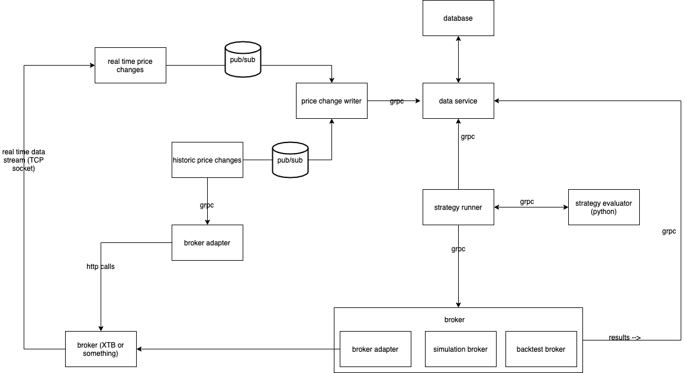

# /kwɒnt/

Distributed CFD trading system which pulls real time price changes from brokers and evaluates python strategies to open/close positons - Written in go & python, deployed on Kubernetes with CockroachDB, Nats.IO, Redis and GRPC!

## What does the name mean?
Quant is pronounced like /kwɒnt/ 

## Disclaimer: do not run this with a real brokerage account yet. This is a prototype. It has not been security tested. In fact it is incredibly insecure. I do not take responsibility for you being an idiot.

## What does this do?
Magic

## Architecture
Some rough diagram 

## Can I steal this?
No :) 
